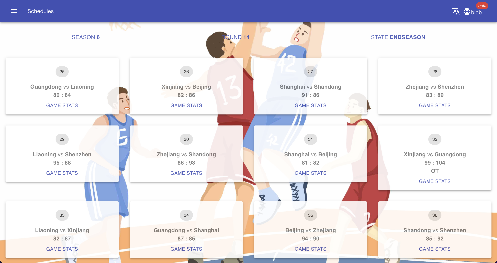

# BLOB

Basketball League on Blockchain is a fantasy basketball game running completely on blockchain. You can build your own team to win championships by managing your roster on the court, drafting new prospects, or trading players. Each team and each player is an ERC721 NFT，which can be transferred within the game or via a third-party market.

Manual: ([English](https://github.com/FanM/blob_game/blob/main/manuals/en/manual.md) | [中文](https://github.com/FanM/blob_game/blob/main/manuals/zh/manual.md))

## Build

Though it's compatible with Truffle, we recommend you use [hardhat](https://hardhat.org/) to build this project.

## Run tests

`npx hardhat test`

## Deploy

Local: `npx hardhat run scripts/deploy-blob.js --network localhost`

Remote: `npx hardhat run scripts/deploy-blob.js --network YOUR_NETWORK`

## Demo

Currently the Beta version of this game is deployed on the [BSC Test](https://docs.binance.org/guides/testnet.html) chain. You can find a running demo from [here](https://blob.oughtto.be/).
